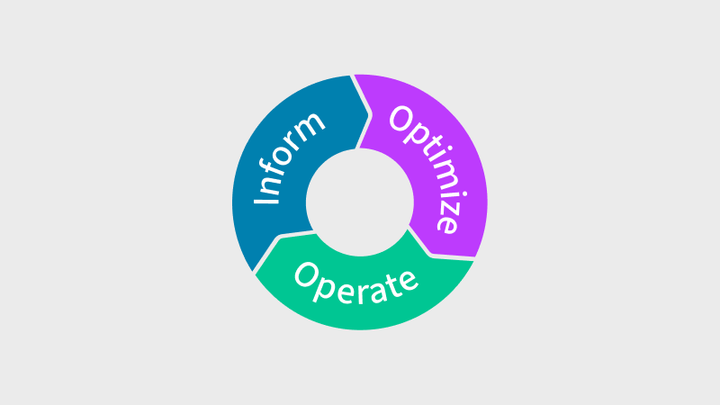

# Этапы FinOps

**FinOps выполняется путем последовательной работы над возможностями платформы на трех этапах: Информирование, оптимизация и эксплуатация.**

Команды внутри организации могут в любой момент работать на разных этапах FinOps, и специалисты FinOps всегда должны следить за использованием облачных технологий в организации, определять пути их улучшения и создавать документацию, позволяющую расширить возможности сотрудников, ответственных за внедрение изменений, которые принесут наибольшую отдачу.

Быстрые действия в обычном режиме могут помочь командам избежать паралича в анализе и закрепить хорошую практику начинать с малого и увеличивать размер и охват действий команды по мере того, как она набирает опыт и динамику.

Цель состоит в том, чтобы постоянно разрабатывать стратегии и совершенствовать рабочие процессы, которые включают действия, охватываемые возможностями платформы, измерять результаты, вносить постепенные улучшения и совершенствовать процесс, чтобы сократить время, необходимое для прохождения этих этапов.

## Информирование

**Наглядность и распределение**

На этапе информирования деятельность FinOps включает в себя определение источников данных для получения данных о затратах, использовании и эффективности облака. Использование этих данных для распределения, анализа и составления отчетов позволяет командам расширять возможности в области составления бюджета, прогнозирования тенденций, определения ключевых показателей эффективности для сравнительного анализа и разработки показателей, которые позволят оценить ценность затрат организации на облачные технологии для бизнеса.

Точное распределение расходов на облачные технологии на основе тегов, учетных записей или бизнес-правил позволяет создавать точные отчеты. Деловые и финансовые команды должны обеспечивать рентабельность инвестиций, не выходя за рамки бюджета, точно прогнозировать расходы и выбросы углекислого газа и избегать неожиданностей. Сравнительный анализ с другими компаниями или между командами позволяет организациям получать показатели, позволяющие понять, насколько эффективно они работают. Объединив все данные о затратах на облако с другими данными об устойчивости, эффективности, использовании и контрольных показателях эффективности для организации, команды должны иметь возможность видеть ключевые показатели эффективности и показатели подразделений, связанные с использованием облака организацией.

Оперативный и эластичный характер облачных технологий в сочетании со сложными ценовыми скидками требует от организаций постоянного пересмотра действий, которые определяют их бизнес-цели посредством принятия решений, основанных на данных, с использованием точной и своевременной информации об использовании облака.

## Оптимизация

**Тарифы и использование**

На этапе оптимизации FinOps-активности направлены на выявление возможностей для повышения эффективности использования облака, основываясь на данных и возможностях, разработанных на этапе информирования.

Облачные провайдеры предлагают множество вариантов для оптимизации облачных ресурсов. Это включает в себя создание возможностей для корректного масштабирования недостаточно используемых ресурсов, использование современных архитектур, управление рабочими нагрузками и автоматизацию устранения избыточных или неиспользуемых ресурсов.

Кроме того, облачные провайдеры предоставляют инструменты для оптимизации тарифов. Это включает в себя возможности для анализа, визуализации и составления отчетов, которые помогают приобретать и управлять скидками на основе обязательств, такими как зарезервированные экземпляры (Reserved Instances, RIs), планы экономии (Savings Plans, SPs) и скидки на основе обязательного использования (Committed Use Discounts, CUDs).

На этом этапе также важна совместная работа команд для улучшения прозрачности, отчетности и процессов управления в тех областях, где показатели единичных метрик указывают на несоответствие производительности облака целям ценности организации.

Варианты оптимизации могут предполагать конкурирующие подходы, но основная цель — разработка набора решений, которые помогут организации получить максимальную ценность от инвестиций в облачные технологии.

## Эксплуатация

**Непрерывное улучшение и использование**

На этапе эксплуатации FinOps-активности направлены на внедрение организационных изменений для повседневного применения FinOps, используя данные и возможности, разработанные на этапах информирования и оптимизации. Это включает установление политик управления облаком, мониторинг соответствия требованиям и обучение сотрудников через разработку учебных программ, руководств для команд и политик автоматизации, соответствующих целям организации.  

Успех FinOps требует создания культуры ответственности, где инженерные, финансовые и бизнес-команды сотрудничают в рамках постоянных, последовательных действий на основе данных, полученных на этапе информирования, выбирая лучшие возможности, выявленные на этапе оптимизации, и применяя подход, ориентированный на действия, в масштабах всей организации.  

На этом этапе важно стремиться к итеративной разработке стратегий и совершенствованию рабочих процессов; это включает возвращение к этапам информирования и оптимизации для совершенствования внедренных возможностей, оценки новых инструментов и развития FinOps-подходов в рамках организации.
